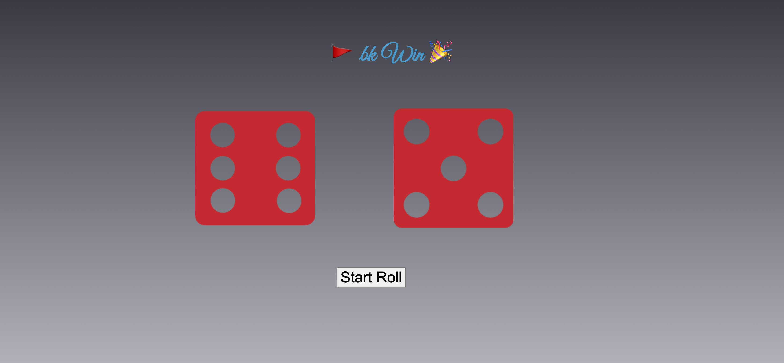

# Dice Roller Game

## Overview
The Dice Roller Game is a fun and interactive two-player game that allows users to roll virtual dice and determine the winner based on the outcome of each roll. Players can enter their names, and with each click of the "Roll Dice" button, the dice are rolled, and the game displays the result, announcing the winner of each round.

## Features
- Play a two-player dice game online.
- Enter the names of the two players.
- Roll dice with a simple click.
- Announces the winner of each round based on dice outcomes.
- User-friendly and engaging interface.
- Responsive design for both desktop and mobile devices.

## Demo
You can try out the Dice Roller Game live at [gamediceroller.netlify.app](https://gamediceroller.netlify.app/).

## Usage
1. Visit the [live demo](https://gamediceroller.netlify.app/) or clone this repository to your local machine.
2. Open the `index.html` file in your web browser to play the game.
3. Enter the names of two players and click "Start Game."
4. Click the "Roll Dice" button to start rolling the dice and determine the winner.

## Technologies Used
- HTML5
- CSS3
- JavaScript

## Author
- [Vivek Tripathi](https://github.com/vivek-tripathi-9005)
